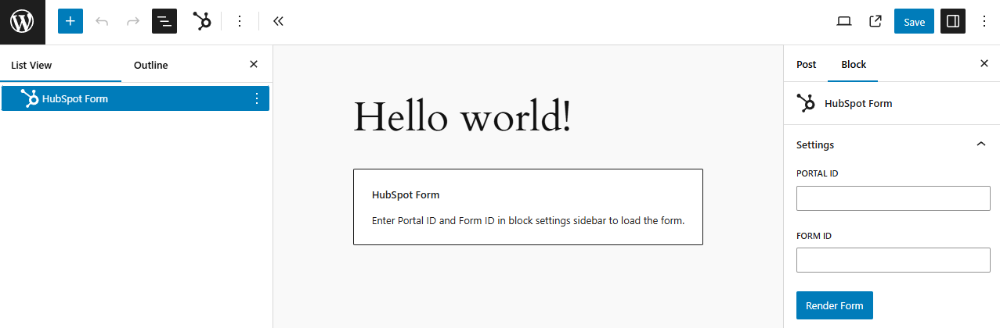

# WordPress HubSpot Form

This WordPress plugin adds a HubSpot Form block which allows you to embed HubSpot forms.

## Screenshot



## GoToWebinar Integration

This plugin contains additional `webinar.js` script which is `GoToWebinar` integration.

To use it, enqueue `webinar.js` script:

```php
add_action(
    'enqueue_block_editor_assets',
    fn() => wp_enqueue_script( 
        'piotrpress-hubspot-form-webinar', 
        plugins_url( 'hubspot-form/webinar.js' ), 
        [ 'piotrpress-hubspot-form-block' ] 
    )
);
```

## Requirements

* PHP >= `7.4` version.
* WordPress >= `6.0` version.

## License

[GPL v3 or later](license.txt)